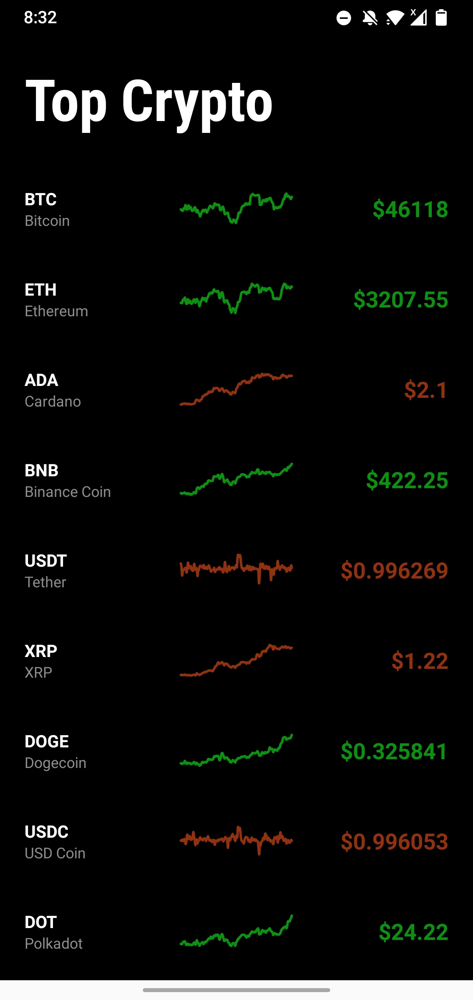
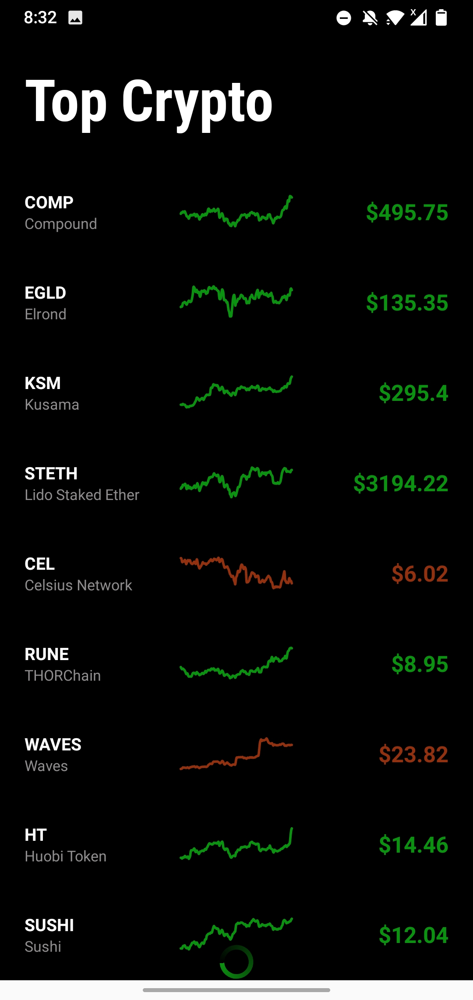
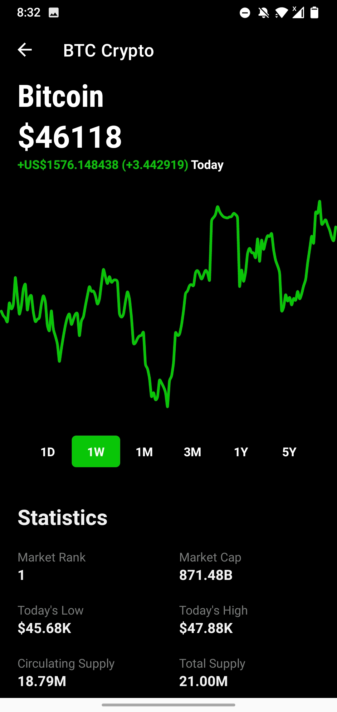
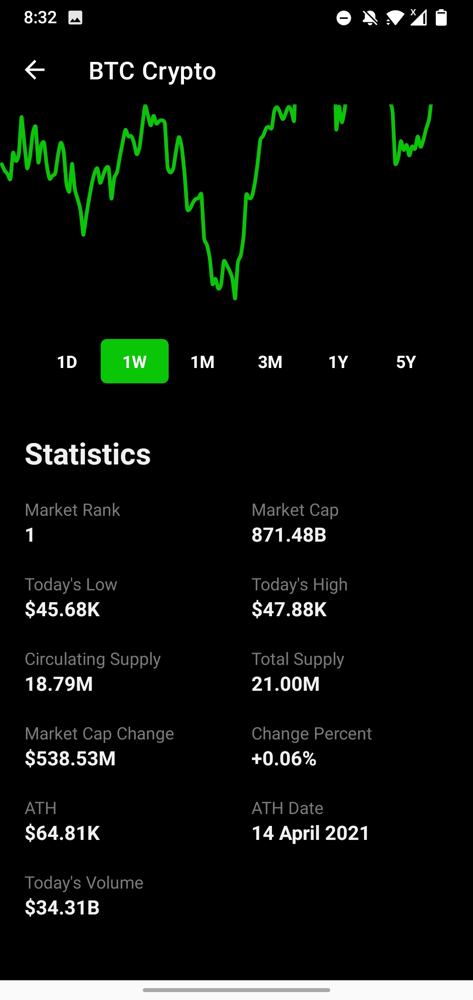
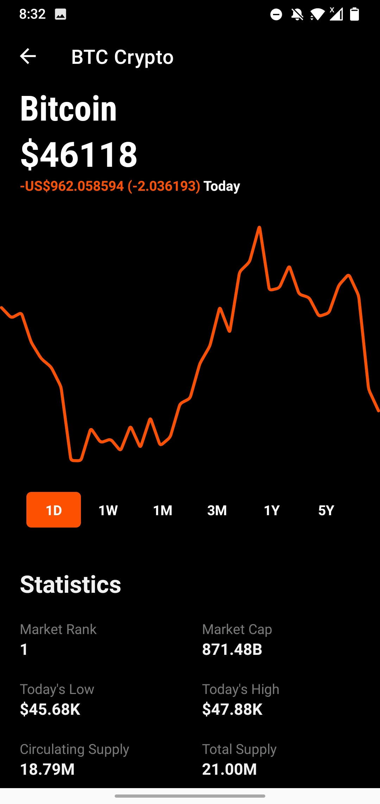
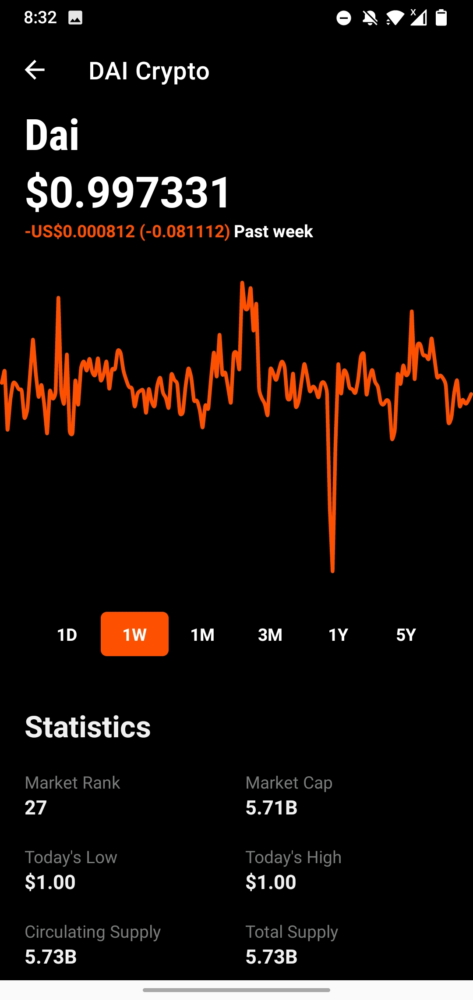
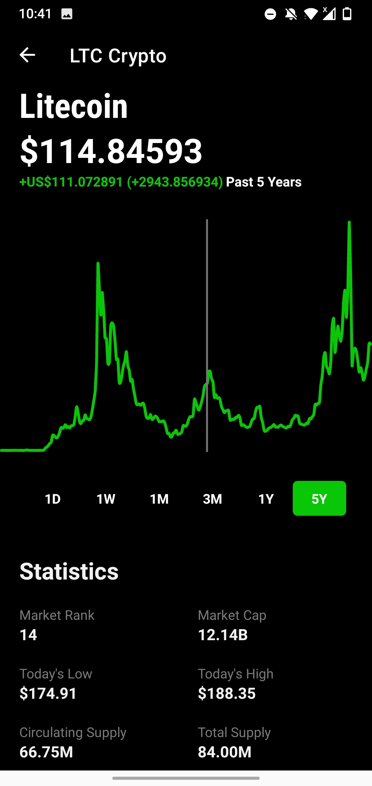
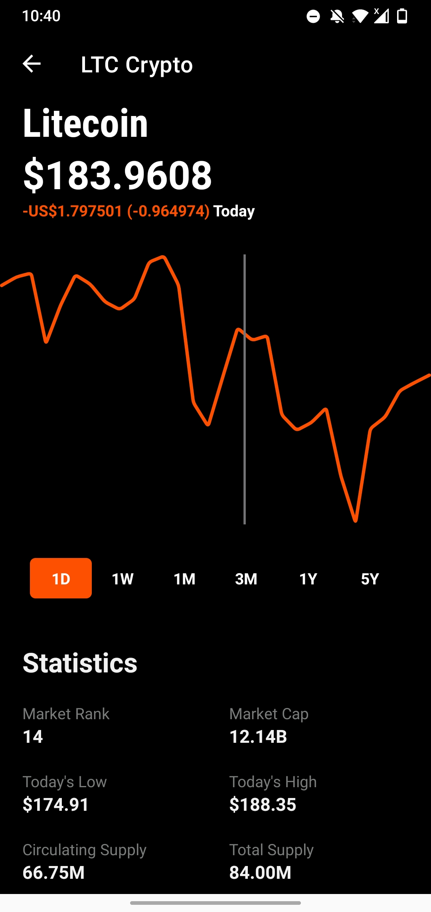

# CryptoAPP
Minimalistic crypto app to display cryptocurrency data with robinhood style theme.

## NOTE:

**This project was made purely for educational and learning purpose.**

## Screenshots

### Home Page (With Lazy Loading)
 

### Coin Page (Ex: Bitcoin) With Statistics
 

### Dynamic Theme
 

### Scrub Enabled In Sparkline
 

## Libraries Used

1. Volley (https://github.com/google/volley)
2. Spark (https://github.com/robinhood/spark)
3. Ticker (https://github.com/robinhood/ticker)

## References

1. CoinGecko API v3 (https://www.coingecko.com/api/documentations/v3)
2. Nomics Sparkline Data API (https://nomics.com/docs/#operation/getCurrenciesSparkline)